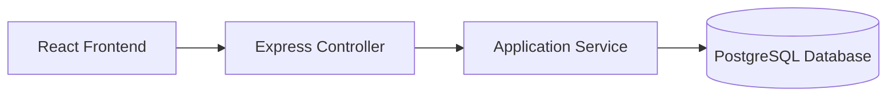
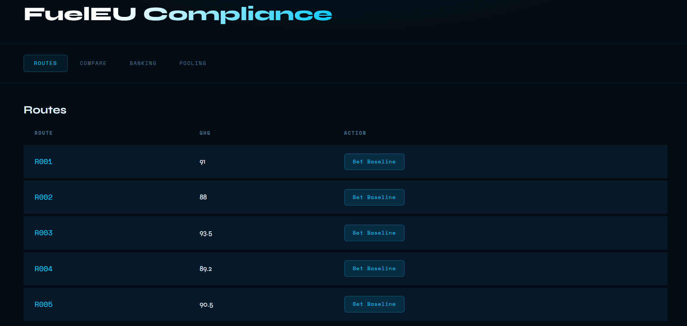
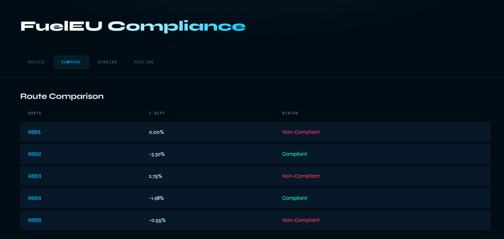
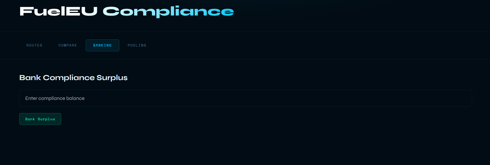
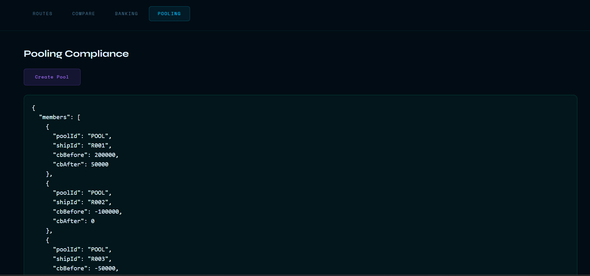

# 🚢 FuelEU Maritime Compliance Dashboard


A full-stack dashboard that evaluates maritime fuel emissions and determines **FuelEU Maritime compliance** for vessel routes.

The application allows users to view vessel routes, select baseline routes, compare emissions performance, and evaluate compliance metrics.

The system is built using **React (frontend), Node.js + Express + TypeScript (backend), and PostgreSQL (database)** following **Hexagonal Architecture** principles.


[](https://github.com/suhel786-byte/fueleu-compliance-dashboard)

### Repository Link
https://github.com/suhel786-byte/fueleu-compliance-dashboard

---

# Overview

The **FuelEU Maritime Compliance Dashboard** helps analyze greenhouse gas (GHG) intensity across maritime routes and determine compliance with FuelEU regulatory targets.

Key features:

* View available vessel routes
* Compare routes against a selected baseline
* Calculate percentage differences in GHG intensity
* Determine compliant vs non-compliant routes
* Simulate **banking compliance calculations**
* Simulate **pooling compliance strategies**

Route data is stored in a **PostgreSQL database** and accessed through REST APIs.

---

# System Architecture

The backend follows **Hexagonal Architecture (Ports and Adapters)** to separate business logic from external infrastructure.

## Layers

### Domain Layer

Contains core business entities.

Examples:

* Route model
* Compliance calculation inputs

---

### Application Layer

Implements business logic and calculations.

Example:

* `computeComparison`

This service calculates the difference between a baseline route and comparison routes.

---

### Adapters Layer

Handles communication with external systems.

Inbound adapters:

* Express HTTP controllers
* REST API endpoints

Example:

```
routesController.ts
```

Outbound adapters:

* PostgreSQL database connection

---

# Architecture Diagram



---

# Database

The system stores route data in a **PostgreSQL database**.

Database name:

```
fueleu_dashboard
```

## Routes Table

| Column        | Type    |
| ------------- | ------- |
| route_id      | VARCHAR |
| vessel_type   | VARCHAR |
| fuel_type     | VARCHAR |
| year          | INT     |
| ghg_intensity | FLOAT   |

The backend accesses the database using the **pg Node.js driver**.

---

# Project Structure

```
fueleu-compliance-dashboard
│
├── backend
│   ├── src
│   │   ├── core
│   │   │   ├── domain
│   │   │   └── application
│   │   └── adapters
│   │       └── inbound/http
│
├── frontend
│
├── screenshots
│
├── README.md
├── AGENT_WORKFLOW.md
├── REFLECTION.md
│
├── package.json
└── tsconfig.json
```

---

# Setup & Run Instructions

## Clone the repository

```bash
git clone <repository-url>
cd fueleu-compliance-dashboard
```

---

## Install dependencies

Backend:

```bash
cd backend
npm install
```

Frontend:

```bash
cd frontend
npm install
```

---

## Start PostgreSQL

Ensure PostgreSQL is running and the database **fueleu_dashboard** exists.

---

## Run backend server

```bash
npm run dev
```

Server runs at:

```
http://localhost:3000
```

---

## Run frontend

```bash
npm start
```

Frontend runs at:

```
http://localhost:3001
```

---

# Example API Request

### Get routes

```
GET /routes
```

### Example response

```json
{
  "routes": [
    {
      "routeId": "R001",
      "vesselType": "Container",
      "fuelType": "HFO",
      "year": 2024,
      "ghgIntensity": 91
    }
  ]
}
```

---

# Application Screenshots

## Routes Page



---

## Route Comparison



---

## Banking Compliance



---

## Pooling Compliance



---

# Technologies Used

Frontend

* React

Backend

* Node.js
* Express.js
* TypeScript

Database

* PostgreSQL

Architecture

* Hexagonal Architecture (Ports & Adapters)

Tools

* Git
* GitHub
* AI-assisted development


# Documentation

This repository also includes:

**AGENT_WORKFLOW.md**

Documents how AI tools were used during development.

**REFLECTION.md**

Provides a reflection on the use of AI agents and productivity improvements.


# Author

Suhel Baig

